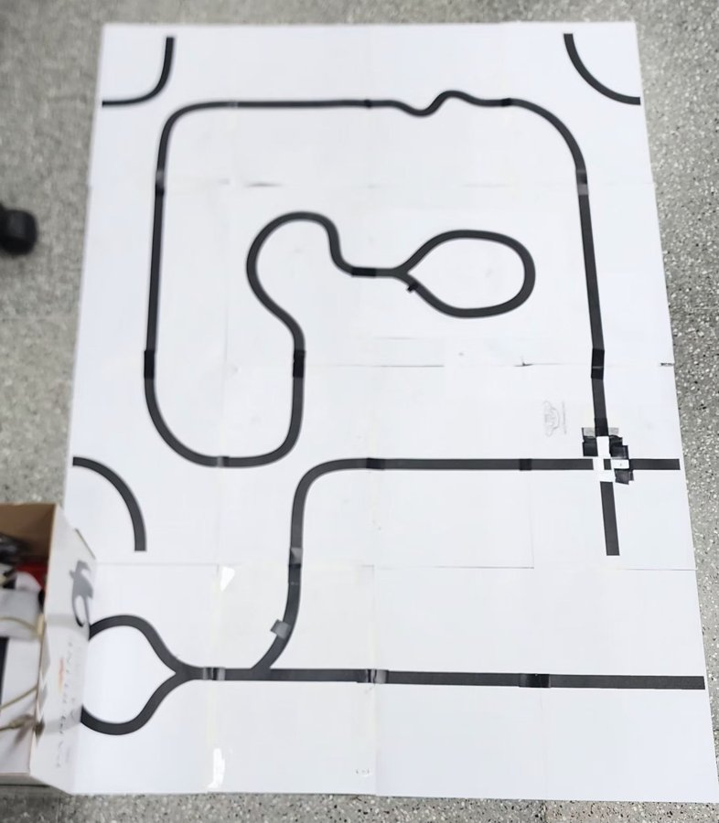
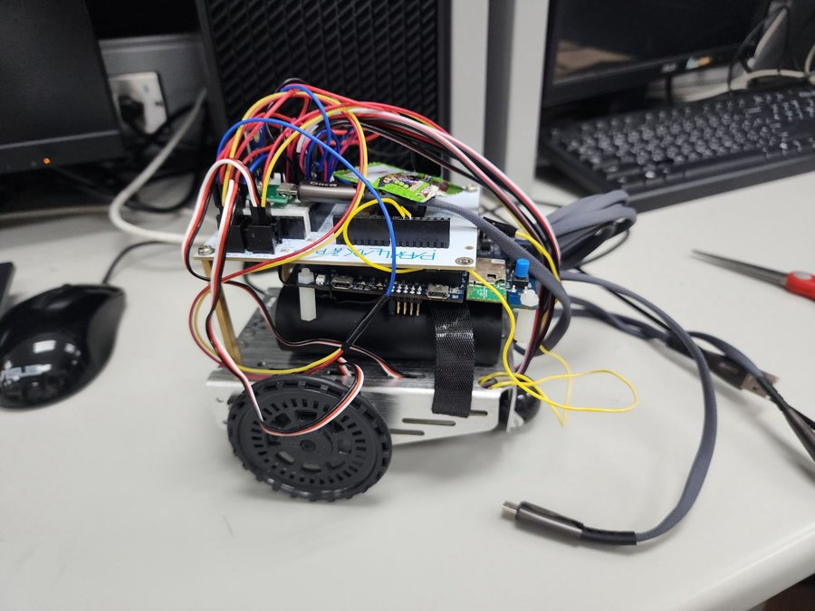
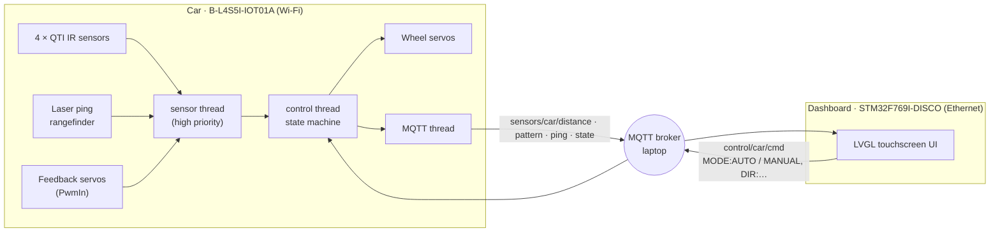

# STM32 Line-Following Car with MQTT Touchscreen Dashboard


Two STM32 boards working together. A Boe-Bot car on a **B-L4S5I-IOT01A** follows a taped track with four IR reflectance sensors, reads trail markers to choose branches, and turns back at obstacles detected by a laser rangefinder, all on board. A **STM32F769I-Discovery** touchscreen dashboard shows the car's live sensor state over MQTT and can switch it to manual driving.

Final project for the **Embedded System Laboratory** at National Tsing Hua University (Spring 2025). Course-provided driver libraries are credited below.

<p align="center">
  
  &nbsp;
  
  <br><sub>Left: the custom track (start on the right, marker squares at the junctions, obstacle box at the bottom left). Right: the car.</sub>
</p>

## System overview



The car never depends on the network to drive: line following, marker handling and obstacle U-turns all run locally. MQTT only carries telemetry out and operator commands in.

## Car behaviour

| State | Behaviour |
|-------|-----------|
| `LINE_FOLLOWING` | Maps the 4-bit QTI pattern to a wheel command: straight, three grades of left/right turn, or pivot turns on the outer sensors. |
| marker `1001` | Junction marker: commits to a timed sharp right turn. `1101` and `1011` are accepted as the same marker (see below). |
| `U_TURNING` | Entered when the **average of the last five** laser-ping readings drops to 15 cm or less; spins in place, then resumes. |
| `OFF_LINE` | Pattern `0000` (lost the line, e.g. on a paper ripple): back up slowly until any sensor sees black again. |
| `MANUAL_CONTROL` | Set from the dashboard; the car executes `DIR:FORWARD/LEFT/RIGHT/BACKWARD/STOP` commands instead. |

Work is split into Mbed OS threads with their own event queues: sensing and control at `osPriorityHigh`, MQTT publishing on its own thread, and logging at `osPriorityLow` so console output only runs when nothing more urgent is ready.

## Problems I hit

| Symptom | Fix |
|---------|-----|
| The car occasionally started spinning in circles. | The QTI sensor sometimes returned wrong values. Editing the driver didn't help; raising `sensor_thread` to `osPriorityHigh` made it much rarer. |
| The junction marker was missed now and then. | Accepted the two neighbouring patterns (`1101`, `1011`) and lengthened the marker on the track to give the car more time to react. |
| Spurious U-turns, even after swapping the rangefinder. | Decide on the mean of five readings against the threshold instead of single samples. |
| The car ran off the track on uneven paper. | Added the `OFF_LINE` state that reverses until the line is found again. |

## Dashboard

The F769 screen shows mode, total distance (from the feedback servos), the latest laser-ping distance, the live 4-square QTI pattern and the car state. Buttons toggle **AUTO / MANUAL**, and drive the car with **FWD / LEFT / RIGHT / BACK / STOP**. A **RESET SENSORS** button publishes `SYS:RESTART`, but the car firmware does not handle that command yet.

## Build

Both firmware images use **[Mbed CE](https://github.com/mbed-ce/mbed-os)** with CMake. Third-party code is not vendored here; place these next to each project's `CMakeLists.txt` before configuring:

| Directory | Car (`car/`) | Dashboard (`dashboard/`) |
|-----------|:---:|:---:|
| `mbed-os/` (Mbed CE) | ✓ | ✓ |
| `components/paho_mqtt/MQTTPacket` | ✓ | ✓ |
| `components/wifi-ism43362` | ✓ | |
| `bsp-b-l475e-iot01/` (on-board sensor BSP) | ✓ | |
| `lvgl/` (v9) and `Utilities/STM32F769I-Discovery` BSP | | ✓ |

```bash
# car
cd car && cmake -B build -GNinja -DMBED_TARGET=B_L4S5I_IOT01A && ninja -C build
# dashboard
cd dashboard && cmake -B build -GNinja -DMBED_TARGET=DISCO_F769NI && ninja -C build
```

Before building, set the Wi-Fi credentials at the top of `car/main.cpp` and the broker address (`MQTT_HOST`) in both `main.cpp` files. Run any MQTT broker (e.g. Mosquitto) on port 1883. `wifi_mqtt/mqtt_client.py` is a small Python client for testing topics from a laptop.

> `car/mbed_app.json` is a copy of the dashboard's file, which already contains the B-L4S5I Wi-Fi overrides; the car's original was not in my backup.

## Repository layout

```
car/                 B-L4S5I-IOT01A firmware
├── main.cpp         threads, state machine, MQTT publish/subscribe
├── bbcar/, pwmin/   course-provided Boe-Bot drivers (servo, QTI, ping, PwmIn)
└── wifi_mqtt/       MQTT network adapter + Python test client
dashboard/           STM32F769I-DISCO firmware
├── src/main.cpp     LVGL UI, MQTT subscribe/publish
└── hal_stm_lvgl/    display and touch drivers for LVGL
docs/media/          track and car photos
```

## Credits

- `car/bbcar` and `car/pwmin`: Boe-Bot car and PWM-input libraries provided by the NTHU EE2405 course (PwmIn originally from [mbed.com](https://os.mbed.com/teams/PRJ1401_LIDAR/code/PwmIn/)).
- `dashboard/hal_stm_lvgl`: LVGL display/touch port for the STM32F769I-Discovery.
- `wifi_mqtt/MQTTNetwork.h`: course-provided Mbed socket adapter for Paho MQTT.

## License

MIT for my own code (see [LICENSE](LICENSE)). `car/bbcar`, `car/pwmin`, `*/wifi_mqtt/MQTTNetwork.h` and `dashboard/hal_stm_lvgl` come from the course or upstream projects and keep their original terms.
